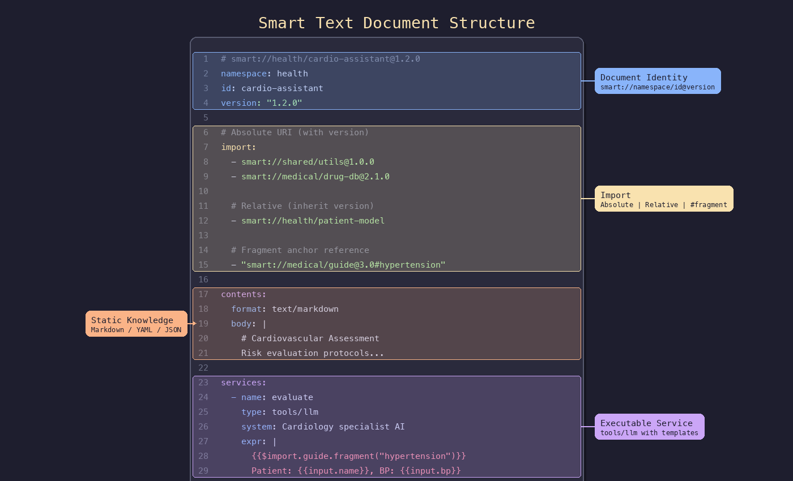
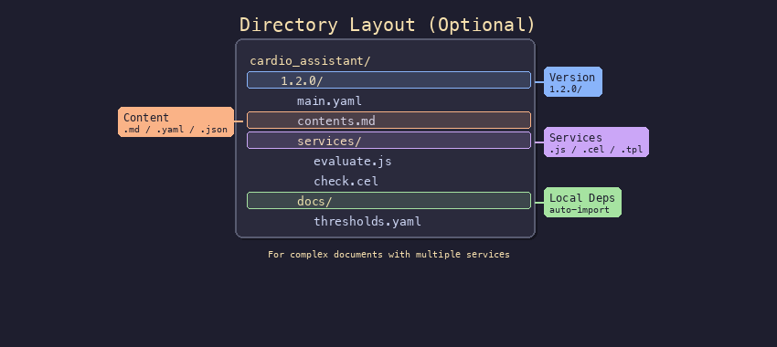

# Smart Text Protocol Specification v1.0.0

[English](README.md) | [中文](README_zh.md)

---

**Version**: 1.0.0 | **Protocol Date**: 2026-03-15 | **License**: MIT

---





---

## Table of Contents

1. [Overview](#1-overview)
2. [Quick Start](#2-quick-start)
   - 2.1 [Example: Hypertension Treatment Guide](#21-example-hypertension-treatment-guide)
   - 2.2 [Example: Health Risk Assessment Assistant](#22-example-health-risk-assessment-assistant)
   - 2.3 [Directory Layout Option](#23-directory-layout-option)
3. [Protocol Overview](#3-protocol-overview)
4. [Core Concepts](#4-core-concepts)
5. [Service Types in Detail](#5-service-types-in-detail)
6. [HTTP API](#6-http-api)
7. [MCP Interface](#7-mcp-interface)
8. [Detailed Specifications](#8-detailed-specifications)
   - 8.4 [File Storage (Single File)](#84-file-storage-single-file)
   - 8.5 [File Storage (Directory Layout)](#85-file-storage-directory-layout)

---

## 1. Overview

### 1.1 What is Smart Text

**Smart Text** is a YAML-based text file format for the AI era that integrates traditional computing capabilities with AI intelligence:

| Content | Block | Description |
|---------|-------|-------------|
| **Document Identity** | Top-level fields | URI-based unified identification with support for inter-document referencing |
| **Static Knowledge** | `contents` | Readable knowledge content |
| **Executable Capabilities** | `services` | Callable service declarations |
| **Reference Capabilities** | `import` | Referencable content with fragment-level referencing support |
| **Metadata** | `meta` | Descriptive information, tags, and extension fields |

### 1.2 One-Sentence Definition

> Smart Text = Versioned Knowledge Content + Executable Knowledge Services + Referencable Knowledge Network

---

## 2. Quick Start

### 2.1 Example: Hypertension Treatment Guide

The `contents` section stores medical knowledge in Markdown format, while `services` provides intelligent Q&A capabilities:

```yaml
# smart://health/htn-guide@1.0.0
namespace: health
id: htn-guide
version: "1.0.0"

meta:
  title: "Hypertension Treatment Guide"
  tags: [hypertension, cardiovascular, treatment-guide]
  author: "Medical Expert Group"

contents:
  format: text/markdown
  body: |
    # Hypertension Classification and Management
    
    ## Normal Blood Pressure {#normal}
    - Systolic < 120 mmHg and Diastolic < 80 mmHg
    - Recommendation: Maintain a healthy lifestyle
    
    ## Stage 1 Hypertension {#stage1}
    - Systolic 140-159 mmHg or Diastolic 90-99 mmHg
    - Recommendation: Lifestyle intervention + consider medication
    
    ## Stage 2 Hypertension {#stage2}
    - Systolic ≥ 160 mmHg or Diastolic ≥ 100 mmHg
    - Recommendation: Initiate medication immediately
    
    ## Hypertensive Crisis {#critical}
    - Systolic ≥ 180 mmHg or Diastolic ≥ 120 mmHg
    - Recommendation: Seek immediate medical attention, assess target organ damage

services:
  - name: query
    text: "Guide Query"
    type: tools/llm
    system: You are a general practitioner answering questions based on the guide.
    expr: |
      Reference Guide:
      {{$contents.raw()}}
      
      Patient Question: {{input.question}}
      
      Please provide professional advice based on the above guide.
```

**Invocation:**

```bash
curl -X POST http://localhost:8088/api/v1/documents/health/htn-guide/1.0.0/services/query \
  -H "Content-Type: application/json" \
  -d '{"question": "Blood pressure 150/95, do I need medication?"}'
```

### 2.2 Example: Health Risk Assessment Assistant

Demonstrates the composition and orchestration capabilities of services (code/js + flow/switch + tools/llm), reusing the hypertension guide from 2.1 through import:

```yaml
# smart://health/risk-assistant@1.0.0
namespace: health
id: risk-assistant
version: "1.0.0"

meta:
  title: "Health Risk Assessment Assistant"
  author: "Zhang San"
  tags: [risk-assessment, blood-pressure]

import:
  # Import the complete guide
  - smart://health/htn-guide@1.0.0
  # Import specific fragments (must be wrapped in quotes to avoid # being recognized as a comment)
  - "smart://health/htn-guide@1.0.0#stage1"
  - "smart://health/htn-guide@1.0.0#stage2"
  - "smart://health/htn-guide@1.0.0#critical"

contents:
  format: application/yaml
  body: |
    healthy_tips: "Maintain a healthy lifestyle and monitor blood pressure regularly"

services:
  # 1. Parameter validation and normalization (code/js)
  - name: normalize_input
    type: code/js
    expr: |
      const sys = $utils.to_number(input.systolic);
      const dia = $utils.to_number(input.diastolic);
      if (isNaN(sys) || isNaN(dia)) {
        throw new Error("Invalid blood pressure format");
      }
      return { systolic: sys, diastolic: dia, age: input.age };

  # 2. Risk classification routing (flow/switch)
  - name: classify_risk
    type: flow/switch
    cases:
      - when:
          type: code/cel
          expr: input.systolic >= 180 || input.diastolic >= 120
        action:
          type: code/cel                      # Inline return, no need to define a service
          expr: |
            {
              level: "critical",
              message: "Critical blood pressure! Seek immediate medical attention!",
              action: "Call emergency services or go to the emergency room"
            }
      - when:
          type: code/cel
          expr: input.systolic >= 140 || input.diastolic >= 90
        action:
          ref: high_risk                      # Reference another service
    default:
      type: code/template
      expr: |
        Your blood pressure {{input.systolic}}/{{input.diastolic}} mmHg is within the normal range.
        Recommendation: {{$contents.yaml("healthy_tips")}}

  # 3. High risk: AI recommendations based on the guide (tools/llm)
  - name: high_risk
    type: tools/llm
    system: You are a professional doctor providing advice based on the hypertension guide.
    expr: |
      Reference Guide:
      {{$import.htn_guide.contents.raw()}}
      
      Patient Blood Pressure: {{input.systolic}}/{{input.diastolic}} mmHg
      Please provide a risk assessment and recommendations based on the guide.

  # 4. Complete assessment workflow (flow/sequence)
  - name: assess
    type: flow/sequence
    steps:
      - normalize_input
      - classify_risk
    merge: last
```

**Invocation:**

```bash
# Single interface completes: validation → classification → intelligent recommendation
curl -X POST http://localhost:8088/api/v1/documents/health/risk-assistant/1.0.0/services/assess \
  -H "Content-Type: application/json" \
  -d '{"systolic": 155, "diastolic": 98}'
```

### 2.3 Directory Layout Option

Instead of a single YAML file, you can organize documents as a directory:

```
health/risk_assistant/1.0.0/
├── main.yaml          # Can be empty or omitted
├── meta.yaml          # Optional metadata
├── contents.md        # Or .json / .yaml / .txt / ...
├── services/
│   ├── normalize_input.js  # or .cel / .tpl / ...
│   └── high_risk.yaml
└── docs/              # Local dependencies (auto-imported)
    ├── thresholds.yaml
    ├── prompts.md
    └── helpers.js
```

**Rules:**
- Use `_` not `.` in names
- Only one `contents.*` allowed
- `docs/` files are auto-imported as local dependencies

---

## 3. Protocol Overview

### 3.1 Core Structure

| Block | Purpose |
|-------|---------|
| **Identity** | `id`, `version`, `namespace` for unique identification |
| **Metadata** | `meta` - Title, tags, author, extension fields |
| **Knowledge** | `contents` - Text, Markdown, YAML, JSON |
| **Capabilities** | `services` - List of callable services |
| **References** | `import` - Reuse other documents, reference fragments |

### 3.2 Content Formats

Use MIME types to declare different content formats:

| format Value | Description | body Type |
|--------------|-------------|-----------|
| `text/plain` | Plain text | string |
| `text/markdown` | Markdown rich text | string |
| `application/json` | JSON data | object/array |
| `application/yaml` | YAML data | object/array |

### 3.3 Service Types

Three types of services cover logic (code), orchestration (flow), and service integration (tools) scenarios, each extensible:

| Type | Syntax | Description |
|------|--------|-------------|
| `code/js` | ES5.1 | JavaScript code execution |
| `code/cel` | CEL | Expression evaluation |
| `code/template` | Mustache | Template rendering |
| `flow/if` / `flow/switch` / `flow/sequence` / `flow/loop` | Custom | Flow control |
| `tools/http` | Custom | HTTP external calls |
| `tools/llm` | Custom | Large language model calls |

### 3.4 Extensions

Scripts in the `extensions/` directory (JS, etc.) are automatically registered to the `$` namespace.

---

## 4. Core Concepts

### 4.1 Document

```yaml
id: example-doc           # Document identifier
version: "1.0.0"          # Semantic version
namespace: default        # Namespace

meta:
  title: "Example Document"     # Display name
  description: "Description"    # Document description
  tags: [tag1, tag2]            # Tag list
  author: "Author"
  created_at: "2026-03-15"
  x-custom-field: "extension"   # Application-level custom fields
```

**URI Format**: `smart://<namespace>/<id>@<version>`

Example: `smart://health/hypertension-thresholds@1.1.0`

### 4.2 Contents (Static Knowledge)

Stores static content that does not depend on external input, supporting multiple formats:

```yaml
# Markdown format - suitable for lengthy documents
contents:
  format: text/markdown
  body: |
    # Operation Guide
    1. First step...
    2. Second step...
```

```yaml
# YAML format - suitable for structured Q&A
contents:
  format: application/yaml
  body:
    faq:
      q1: 
        question: "Common Question"
        answer: "Detailed answer content..."
```

```yaml
# JSON format - suitable for configuration data
contents:
  format: application/json
  body:
    threshold: 100
    enabled: true
```

#### Content Fragments

For YAML format content, each top-level key can be referenced independently:

```yaml
contents:
  format: application/yaml
  body:
    # These keys can be referenced via smart://...#medications
    medications:
      first_line: [Amlodipine]
    thresholds:
      stage1: {sys: 140, dia: 90}
```

For Markdown format content, anchors can be defined using `{#anchor}`:

```markdown
## Medication Treatment {#medications}
Content...

## Lifestyle {#lifestyle}
Content...
```

### 4.3 Services (Executable Capabilities)

Defines callable services:

```yaml
services:
  - name: my-service        # Service identifier
    text: "My Service"       # Display name
    type: code/js           # Service type
    # ... type-specific configuration
```

### 4.4 Import (Reference Mechanism)

References other documents via URI, supporting full documents or fragment-level references:

```yaml
import:
  # Simplified form - import the complete document
  - smart://health/thresholds@1.1.0
  
  # Full form - specify an alias
  - uri: smart://common/utils@1.0.0
    as: utils
    
  # Fragment reference - must be wrapped in quotes
  - "smart://health/htn-guide@1.0.0#medications"
  - "smart://health/htn-guide@1.0.0#critical"
```

**Reference Rules**:
- Full document: Merge the knowledge of the referenced document into the main document (append text, merge structured content), and append the referenced document's services
- Fragment reference (`#fragment`): Only load the content of the specified fragment, accessible via `$import.<alias>.contents.fragment("fragment_name")`

---

## 5. Service Types in Detail

### 5.1 Local Computation

#### code/js

```yaml
- name: calculate
  type: code/js
  timeout_ms: 5000                    # Timeout (default 5000)
  expr: |
    // Access input
    const val = input.x;
    
    // Access knowledge in contents
    const cfg = $contents.json("threshold");
    const doc = $contents.raw();     // Read raw text (e.g., Markdown)
    
    // Access imported documents
    const imported = $import.utils.contents.json("config");
    
    // Call other functions
    const result = $call("other", {x: 1});
    
    // Utility functions
    $utils.to_number(x);
    $utils.coalesce(a, b);
    $utils.json_encode(obj);
    $utils.now();
    
    console.log("debug");            // Log output
    
    return result;
```

#### code/cel

```yaml
- name: check_age
  type: code/cel
  expr: input.age >= 18 && input.status == "active"
```

#### code/template

Mustache syntax with CEL expression support via `[[ ]]`:

```yaml
- name: generate_text
  type: code/template
  expr: |
    Hello, {{input.name}}!
    Total: [[price * quantity]]
    Status: {{$call("get_status", input)}}.
```

### 5.2 Flow Control

#### flow/if

```yaml
- name: conditional
  type: flow/if
  condition:
    type: code/cel
    expr: input.valid == true
  then:
    ref: process
  default:
    ref: reject
```

**then/default Description**:
- `ref: <name>` - Reference another service for execution
- `{type: <type>, expr: ...}` - Inline code execution

#### flow/switch

```yaml
- name: classify
  type: flow/switch
  cases:
    - when:
        type: code/cel
        expr: input.score >= 90
      action:
        ref: handle_a                      # Reference another service
    - when:
        type: code/cel
        expr: input.score >= 80
      action:
        type: code/cel                     # Inline code
        expr: "B"
  default:
    type: code/cel
    expr: "C"
```

**action Description**:
- `ref: <name>` - Reference another service for execution
- `{type: <type>, expr: ...}` - Inline code execution

#### flow/sequence

```yaml
- name: pipeline
  type: flow/sequence
  steps:
    - validate
    - transform
    - save
  merge: last                       # last | all | object
```

#### flow/loop

```yaml
- name: batch_process
  type: flow/loop
  over: input.items                 # Array path
  as: item                          # Iteration variable name
  do: process_item                  # Function to execute for each element
  concurrency: 5                    # Concurrency (default 1)
```

### 5.3 External Tools

#### tools/http

Template syntax (Mustache + CEL via `[[ ]]`) supported in `url`, `headers`, and `body`:

```yaml
- name: api_call
  type: tools/http
  method: POST
  url: https://api.example.com/data
  headers:
    Authorization: Bearer {{$contents.json("api_key")}}
  body:
    key: "{{input.value}}"
  response_path: data.result
  timeout_ms: 10000
```

#### tools/llm

Both `system` and `expr` support template syntax (Mustache + CEL via `[[ ]]`):

```yaml
- name: ask_ai
  type: tools/llm
  model: gpt-4
  system: "You are a helpful assistant. Context: {{$contents.raw()}}"
  expr: "{{input.question}}"
  temperature: 0.7
  max_tokens: 2000
```

---

## 6. HTTP API

### 6.1 Basics

- **Base URL**: `http://localhost:8088`
- **Content-Type**: `application/json`

### 6.2 Endpoints

| Method | Path | Description |
|--------|------|-------------|
| GET | `/api/v1/health` | Health check |
| GET | `/api/v1/documents` | List documents |
| GET | `/api/v1/documents/{namespace}/{id}/{version}` | Get document |
| GET | `/api/v1/documents/{namespace}/{id}/{version}/contents` | Get contents |
| GET | `/api/v1/documents/{namespace}/{id}/{version}/contents/{fragment}` | Get specific fragment |
| POST | `/api/v1/documents/{namespace}/{id}/{version}/services/{name}` | Execute service |

### 6.3 Response Format

**Success**:
```json
{ "data": { ... } }
```

**Error**:
```json
{ "error": { "code": "...", "message": "..." } }
```

### 6.4 Streaming Output

LLM functions support SSE streaming responses:

```bash
curl -H "Accept: text/event-stream" \
  http://localhost:8088/api/v1/documents/health/htn-guide/1.0.0/services/query
```

Event types: `connected`, `chunk`, `reasoning`, `complete`, `error`

---

## 7. MCP Interface

### 7.1 Endpoint

```
POST /mcp
```

### 7.2 Tool List

| Tool Name | Description |
|-----------|-------------|
| `smarttext.list` | Query documents (supports filtering by namespace, tags) |
| `smarttext.read` | Read document or specific fragment |
| `smarttext.execute` | Execute function |

---

## 8. Detailed Specifications

### 8.1 Top-Level Fields

| Field | Type | Required | Description |
|-------|------|----------|-------------|
| `id` | string | ✅ | Document identifier (lowercase, numbers, hyphens, underscores) |
| `version` | string | ✅ | Version number `A.B.C` or `A.B.C.D` |
| `namespace` | string | ✅ | Namespace (starts with lowercase letter, `a-z0-9_-`, 1-32 characters) |
| `meta` | object | ❌ | Metadata block |
| `import` | array | ❌ | Import list |
| `contents` | object | ✅ | Static knowledge block |
| `services` | array | ❌ | Executable service list |

### 8.2 Meta Fields

| Field | Type | Description |
|-------|------|-------------|
| `title` | string | Display name |
| `description` | string | Document description |
| `tags` | array | Tag list for retrieval and classification |
| `author` | string | Author |
| `created_at` | string | Creation time (ISO 8601 format) |
| `updated_at` | string | Last update time (ISO 8601 format) |
| `status` | string | `draft` / `published` |
| `x-*` | any | Application-level extension fields |

### 8.3 Constraint Rules

**id Rules**:
- Length: 1-64 characters
- Characters: `a-z`, `0-9`, `-`, `_`
- Must start with a lowercase letter

**version Rules**:
- Format: `A.B.C` or `A.B.C.D`, numeric

**import URI Rules**:
```
smart://<namespace>/<id>[@<version>][#<fragment>]
```

- No `@version`: Uses the current document version as fallback
- With `#fragment`: Only loads the specified fragment (must be wrapped in quotes to avoid YAML comments)

### 8.4 File Storage (Single File)

```
<data-dir>/<namespace>/<id>/<version>/main.yaml
```

Example:
```
data/docs/health/bp-assistant/1.0.0/main.yaml
```

### 8.5 File Storage (Directory Layout)

For complex documents, you can use directory layout instead of single YAML:

```
<data-dir>/<namespace>/<id>/<version>/
├── main.yaml          # Optional, can be empty
├── meta.yaml          # Optional metadata
├── contents.md        # Or contents.json / contents.yaml (pick one)
├── services/          # Service declarations
│   └── query.js       # Or .yaml
└── docs/              # Local dependencies (auto-imported)
    ├── thresholds.yaml
    ├── prompts.md
    └── helpers.js
```

**Rules:**
- `id` must use `_` not `.` (e.g., `risk_assistant` not `risk.assistant`)
- Content format: only one of `contents.md`, `contents.json`, `contents.yaml` allowed
- Service naming: `services/query.js` or `services.query.js`, conflict = error
- `docs/` files are auto-imported as local dependencies

---

## Appendix

### A. Version History

| Version | Date | Description |
|---------|------|-------------|
| 1.0.0 | 2026-03-15 | Initial stable release |

### B. License

MIT License - See LICENSE file for details
